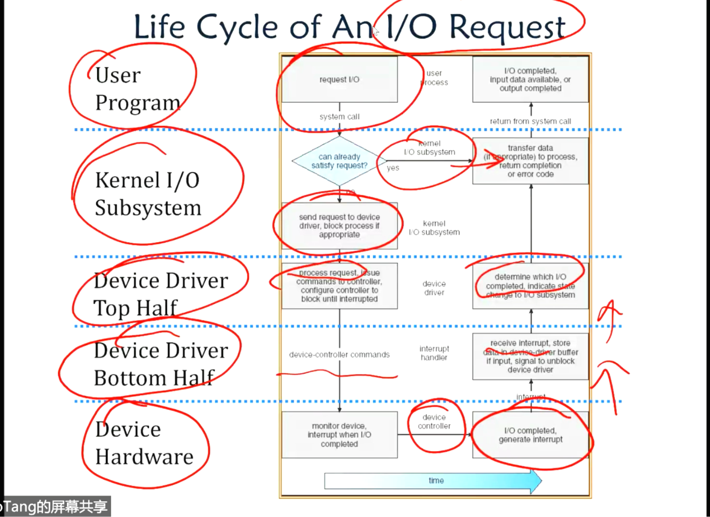

<!--
 * @Github: https://github.com/Certseeds/CS302_OS
 * @Organization: SUSTech
 * @Author: nanoseeds
 * @Date: 2020-06-04 10:37:26
 * @LastEditors: nanoseeds
 * @LastEditTime: 2020-09-02 01:27:01
 * @License: CC-BY-NC-SA_V4_0 or any later version 
 -->
1. What is an OS?
   OS is a special layer.
   + 将复杂的硬件抽象成可以被统一使用的.(everything is file in linux).
   + 保护共享资源,比如在rom里阻止进程互相影响.(进程的地址空间隔离).
   + 安全,权限问题,比如文件句柄,访问等等权限.某些功能只能在kernel mode提供,另一些只有在user model提供.防止互相乱用.
   + 在不同的硬件逻辑之间的交流,比如HDD && RAM.

2. OS basics:1st virtual machine boundary.
  + Software and HardWare, processor and memory.
  + 将OS hardware virtuallization 做的比较好,make hardware resource can be access by softwares easily like process, files, windows and sockets.
  + OS抽象出硬件,使其可以被软件操纵,提供一个转换的功能.

3. OS basics:2nd Program and process.
  + system should schedule the process, load process in memory, it can run now, then it have a address space.
  + when obtain the computer, the system is aleadly in memory.

4. OS basics :3rd Context swtich.
   + when a process do not be need, it is used up. then another process(like $p_B$)can/will be load in memory(or called be scheduled).
   + move the processor from A to B.
   + move process A Realease from CPU(back to memory, os or even disk),let CPU be aviable for other process,then load another process to CPU. switch process is expensive, because should load address space memory space,flush memory, and update registers and even TLB, etc.

5. OS basics:4th scheduling, Protection.
  + Schduling, a set of process,let run them by schduling algorithm.
  + Protection: when run in memory space, process can not be modefityed by another process. also means , different process should not by update or clashed by os and hardware reasons.

6. OS basics:5th IO.
  + read data from storage or get input from keyboard(etc) must by IO.
  + everything is linux is a file.( so OS should make), abstract different hardware as file then OS can provide a uniform interface that can be use by processes.

7. OS basics:6th Loading.
   + when run a problem, what should do, write it complier it, exectute the exextable,获取内存,run it when it get the cpu, from the stroage to memory.

Until now, overview the orgrainze of OS,when we introduce OS we can follow this concepts.
8. Four Fundamental OS Concepts.
   + Thread, single unique exectution context, fully describes program state.
     - program Counter, Registers ,Execution Flags,Stack. 线程.
   + Address Space with Translation, MMU( memory management unit)
     - Programs execute in an address space that is distinct from the memory space of the physical machine.
     - Only ask simple questions, which unit transfer the address like which unit transfer the memory address.(answer is mmu of course).
   + Process,an instance of exectuing program, is a process consisting of an address space and one or more threads of control.
   + Dual mode operation/protection.
     - 只有OS有能力获取到确定的资源, OS与硬件被保护起来, 用户程序之间被互相隔离起来了. By controlling the translation from program virtual address to amchine physical addresses.

9. First OS Conncept: Thread of Control
  + Certain registers hold the context of thread.
  + Stack Pointer hold the address of the top of stack
    - and Frame pointer,Head Pointer, Data.
  + May be definied by the instrction set architecture or by compiler conventions.
  + Thread is Single unique execution context,单个独立执行上下文.
    - Store Program Counter,Registers,Exectuion Flags and Stack.
  + A Thread is executing on a processor when it is resident in the processor registers.线程执行的时候,其驻留在处理器寄存器中.
  + PC register hold the exectuing instruction in the thread,PC寄存器放下一个执行的语句地址.
  + Register hold the root state of the thread, the rest is in memory,最重要的都在寄存器里,其他的在内存里.

10. Second OS concept: Program's Address space.
  + show a picture, which have stack ,heap, static data and code.
  + address space == set of accessible addresses + state associated with them.
    -  32-bit cpu = 2^32 = 4 billion address(4GBytes).
  + when read or write to address.
    - perhaps nothing. address is not used.
    - perhaps acts like regular memory.
    - perhaps ignore writes, can not be write.
    - perhaps causes IO operations,Memory-mapped memory, need IO.存储器映射输入输出 (Memory-mapped I/O),实际上是将外设的地址映射到内存上,用统一的方式来读写.和内存映射文件不同.
    - perhaps causes exception,why? because the page is not in memory, should load it.
  + what we have learned?

11. 3rd Concepts: Process.
  + execution environment with restricted rights(权限受限的执行环境).
  + own memory --- 有独立的address-space.
  + owns file fdescriptors file system contet,有文件描述符,可以占用硬件.
  + Encapsulate one or more threads sharing process resources.封装了线程.
  + Why choose process?
    - Protected from each other. 地址空间互相对立.
    - OS protected from them. 会阻止想要访问对方的行为.
    - processes provides memory protection. can only access itself's space.
    - Threads more effcient than processes. thread is a lite version process.
  + 进程间通信比进程内communication困难多了.
    - 进程内通信:信号量,事件,互斥量.
    - 进程间通信:管道(匿名管道,具名管道),信号,消息队列(depend on kernel),共享内存,socket. 
  + Applications can have multiply process.s

12. 4th OS conexpt: Dual Mode Operation
  + Hardware provides at least two modes
      - kernel model ( "protected")
      - User model( normal programs executed) 
  + what is needed in the hardware to support dual mode operation?
      - A bit of state(user/system) 
      - Certatin operations/ actions that only permitted in system/kernel mode
          * of course, in user mode they fail or trap
      - User -> Kernal transition sets system mode and save the user PC.
          * Operating system code carefully puts aside user state then performs the necessary operations.
      - Kernel->User transtion clears system mode and restores appropriate user PC.
          * return from interrupt

13. Process life cycle.(user space!!)
  + three state:Running, Waiting and Termination.
  + running and waiting can transfer to each other.
  + running can also turns to termination.

14. Fork in action - finish.
  + use fork, father process stop action.
  + then copy the message in PCB like address-space, file description.
  + then write the different message likd pid,ppid and running time, childreds.
      - (child's pid is ***Not*** fathers pid+1!!!)
  + it is done in kernel mode.
  + (详细的创建过程见[report02_overview](./../report_02_lab03/overview.md)),很可能考.

15. process lifestyle (Kernel space!!!)
  + all process is forked.
  + then it turns to ready,then it can trun to or from running.
  + running can turn to blocked/waiting which can be devide interruptible and un-interruptible.
  + blocked will turn to ready when it blocked finish.
  + running will be zombie ( or terminated ) in the end.

16. what is context switch.
  + scheduling is the procedure that decides which process to run next.
  + context swtich is the actual switching procedure, from one process to another.
  + what can lead to context switch?
      - RR里的timer interrupt. 
      - Hardware interrupt.

17. What is process scheduling?
  + Scheduling is an important topic in the research of the operating system.(System reaserch) not introduce?
    + Related theoretical topics are covered in computer system performance evalution.
  + scheduling is required because the computing resource the CPU is **limited**.
    + CPU-bound process, AI course assignments. CPU time > sys-time
    + IO bound process. sys-time > user time, like `/bin/ls`,networking programs.

18. Scheduling algorithms.
  + Input to the algorithms:
    + A set of tasks.
    + For each tasks.
      + Arrival Time.
      + CPU requirement. (这一项的估计与获取非常困难)
  + WHat is Online and offline algorithm.
    + An offline scheduling algorithm assume all the sequece of process that will face,通常只用来计算理论值.
      + 典型案例:MIN,需要知道哪一个进程未来最晚被用到.
    + An online algorithm do not know what will happen.
      + all other algorithm is that. SJF,FIFO等等算法都是需要了解的,建议参考[midterm](../midterm_2019/README.md).

19. ` ls | less `在kernel中的详细过程.
  + in user space, shell analysis the command ,create `ls`,`pipe`,`less`.
  + `pipe()` create a piece of  shared FIFO queue in the kernel space.
  + `ls` write to the queue,`less` read from the queue.
  + this queue is fixed size.

20. 既然this queue is fixed size. 那么.
    there have synchronization problems.
    + the producer is `ls`.
    + the consumer is `less`.
    + this is a producer-consumer problem, a synchronization problem.可以用信号量,锁,条件变量解决???这不是一个进程内才能用的吗.
    + it's if produce to fast? it is Inter-process-comminucation problem.

21. 哲学家进餐问题,死锁.跳过一张图.
    死锁四条件
    + Mutual exclusion,资源被独占.
    + Hold and wait,Threads 拿着被别的Thread需要的资源,但是自己不会释放已经拿到的,就干等.
    + No preemption.
        + Resources are released only voluntarily by the thread holding the resource, after thread is finished with it. OS不会强制释放进程的资源,典型反例抢占式调度算法RR.
    + Circular wait,循环等待. >=2.
  
23. Binding of instructions and data to memory.
    + 把内存地址转换到物理地址.

24. Uniprogramming,单程序,直接用物理地址.
25. general address translation.
  + transfer virtual addreess to physical address by mmu.
  + 地址空间:
      - all the address and state a process can touch.
      - each process and kernel has differnet address space.(用来隔离和保护)
  + two views of memory.
      - view from CPU (virtual memory).
      - view from memory, physical memory.
      - translation box,(MMU) between two views.
  + Translation makes it much easier to implement protection. 
      - Between process, if they can not touch each other's memory, they will no way to affect each other.
  + With translation, every program can be linked/loaded into same region of user address space.
  
26. 地址转换这一块看[report_06.md](./../report_06_lab09/report06.md)后半部分,掠过.
PS:好怪,为啥是先讲页表再讲分页.

28. Demand paging.
  + 内存增长很快,但是90%时间只用10%内存.
  +  so use main memory as cache of disk.
  + 所以这里又需要置换算法
  + FIFO,MIN,LRU(use list 优化),LRU优化之Second-change.

29. Transferriing data to/from controller.
  + programmed I/O
      - each byte transferred via process.
      - simple hardware, easy to program.
      - 但是会Consumer processor cycles proportional to datasize.big data cost too much time.
      - 因为每byte都要via process,所以file size 与cost time线性相关,不行.
  + DMA: direct memory access.
      - give controller access to memory bus.
      - ask it to transfer data blocks to/from memory directly.
      - 过程请看[report_08.md](./../report_08/report_08.md),此处略.

30. Life cycle 
  

31. Disk scheduling.
    FIFO,SSTF,SCAN,C_SCAN,LOOK,CLOOK等等
    期末考试里,只需要会计算方式,也就是说把算法记住.
    建议抄样例(逃

32. FAT机制,file allocation table.
    1. 文件名->内部存储首地址(base)和长度(limit),首地址之后的每一块内存都用链表实现.
    2. FAT内部的每个entry是32Bytes.(不是bit,有丶复杂)

33. 设计file system
  + what factors are critical to teh design choices.
  + durable data store => all on disk.
  + (Hard) disks performance!!!
      - Maximize sequential access, minimize seeks.
  + Open before read/write.
      - can perform protection checks and look up where the actual file resource are, in advance.
  + Size is determined as the are used.
      - can write to expand the file.
      - start small and grow, need to make room. 
  + Organized into directories.
      - what data structure (on disk) for that 
  + Need to allocate/free blocks.
      - suck that access remains efficient.

34. Inode, File system size and maxmium file size is difference.
  + 多级指针具体计算方式参考[notes_lec12.md](./../report_09/notes_lec12.md).

35. Using paging to mmap() files.(内存映射函数,将文件映射到内存中).
  + process use virtual address by mmu to physical addreess in memory.
  + if this page not in page table, exception by OS read the file , load it to memory, update table.
  + then retrie it once again.
  + get the page table and get the file in memory.
  + memory maped files, create PT entries for mapped region as "backed" by files.
  + when read file read it in memory, until unmmap write it back to disk.

36. inode array的大小,一个inode 128 bytes. file system size 一会儿解释.
    + 考试内容80%以上出自这些里面.
    + 成绩分布
      + 20分class participations.
      + 20分 lab exercises.
      + 12分 Project tutorial 
      + 50分final examination.
      + 3分 Bonus.
      + 总分105,取最大值100.

37. 毕业班
  + report 3k字 +面试, 10分,两次选择,五分钟topic presentation and 五分钟question and answer.
  + 或者考试,95%出自这里,2张cheating paper,满分110,20+分原题,30分不定项选择,20分简答,60分其他.
    + 包括process magagement, memory management, file system. 